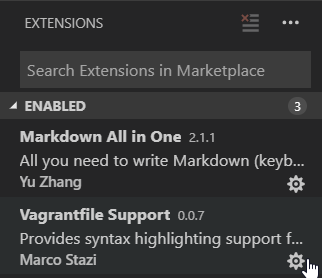

M300 - LB1
======

## Inhaltsverzeichnis
* K1
  * VirtualBox
  * Vagrant
  * Visualstudio-Code
  * Git-Client
  * SSH-Key für Client erstellt
* K2
  * Github oder Gitlab-Account ist erstellt
  * Git-Client wurde verwendet
  * Dokumentation ist als Mark Down vorhanden
  * Mark down-Editor ausgewählt und eingerichtet
  * Mark down ist strukturiert
  * Persönlicher Wissenstand
  * Wichtige Lernschritte sind dokumentiert
* K3
  * Bestehende VM aus Vagrant-Cloud eingerichtet
  * Kennt die Vagrant-Befehle
  * Eingerichtete Umgebung ist dokumentiert
  * Andere, vorgefertigte vm auf eigenem Notebook aufgsetzt
  * Projekt mit Git und Mark Down dokumentiert
* K4
  * Firewall eingrichtet inkl. Rules
  * Benutzer- und Rechtevergabe ist eingerichtet
  * Zugang mit SSH-Tunnel abgesichert
  * Sicherheitsmassnahmen sind dokumentiert
  * Projekt mit Git und Mark Down dokumentiert
* K5
  * Vergleich Vorwissen - Wissenzuwachs
  * Reflexion

___

Installation der Tool-Umgebung
======

## Virtualbox
Im ersten Schritt habe ich Virtualbox auf meinem Rechner installiert.
Die Source dafür habe ich unter https://www.virtualbox.org/wiki/Downloads heruntergeladen.

## Vagrant
### Was ist Vagrant?
Vagrant ist eine Ruby-Anwendung zur Erstellung von Virtuellen Maschinen. Vagrant vereichnacht dabei die Virtualisierung, das sie um einiges schneller ist, als die Maschinen immer wieder von Hand aufzusetzen.
### Installation
Die Installationssource habe ich hier heruntergeladen: https://www.vagrantup.com/downloads.html
## VisualStudio Code
### Was ist VisualStudio Code?
VisualStudio Code ist ein Editor zum editieren von Sourcefiles. Es können dabei Extensions installiert werden. So kann das Syntax-Highlighting von sehr vielen verschiedenen Skript- oder Programmiesprachen realisiert werden. Die Extensions werden dabei von Usern oder grossen Firmen bereitgestellt.
### Installation
Ich habe VisualStudio Code von dieser Webseite heruntergeladen: https://code.visualstudio.com/Download
### Installierte Extensions
Im unteren Screenshot ist zu sehen, welche Extensions wir für unsere Arbeit installieren mussten:

## Git-Client
### Was ist der Git-Client
Der git-Client ermöglicht das ausführen von Git-Befehlen auf dem lokalen Rechner. Git wird gebraucht um Repositories von Github herunterzuladen, zu aktualisieren und Updates davon zu beziehen. 

### Installation
Die Source wurde von dieser Webseite heruntergeladen: https://git-scm.com/downloads
### Konfiguration
1. Git Bash auf dem Rechner öffnen
2. 	Diesen Code ausführen (Angaben vom eben erstellten Account auf github.)
~~~~
  $ git config --global user.name "<username>"
  $ git config --global user.email "<e-mail>"
~~~~
### Repo klonen

1. Git Bash öffnen
2. Diesen Code ausführen
~~~
$ git clone https://github.com/mc-b/M300
~~~
Es wurden nun ein neuer Ordner mit den heruntergeladenen Daten erstellt.
Der gleiche Befehl muss nun für das eigene Repo ausgeführt werden.
### Commit & Push
Um einen Commit und einen Push zu machen. Muss dieser Ablauf von Befehlen durchführen:
1. Zum eigenen Repo wechseln:
~~~
$ cd Pfad\zu\meinem\Repository
~~~
2. Alle Dateien dem Commit hinzufügen, commiten und pushen:
~~~
$ git add -A .
$ git commit -m "Commit-Kommentar"
$ git push
~~~

## SSH-Key
### Auf Client erstellen
Der SSH-Key kann mit diesen Commands in Git Bash erstellt werden:
~~~
 $  ssh-keygen -t rsa -b 4096 -C "schmidt.tim2001@gmail.com"
   Enter a file in which to save the key (~/.ssh/id_rsa): [Press enter]
   Enter passphrase (empty for no passphrase): [Passwort]
   Enter same passphrase again: [Passwort wiederholen]
~~~
### Auf github hinzufügen
1. Auf github anmelden
2. Unter Settings einen neuen SSH Key hinzufügen.
3. Inhalt aus File id_rsa.pub einfügen
4. Auf Add klicken

Erstellen der ersten VM's mit Vagrant
===

## Wichtigste Befehle unter Vagrant
~~~
$   vagrant init
~~~
Initialisieren von Vagrant in einem Verzeichnis. Damit wird ein Vagrantfile erstellt und der Ordner .vagrant angelegt.

~~~
$   vagrant up
~~~
Vagrant-VM mit einem Vagrantfile erstellen.

~~~
$   vagrant ssh
~~~
Verbinden mit einer VagrantVM die erstellt wurde.

~~~
$   vagrant provision
~~~
Änderungen in einem Vagrantfile in die bereits erstellte VM einspielen(z. B. neu hinzugefügte Shell-Befehle)

~~~
$   vagrant destroy -f
~~~
Erstellte VagrantVM's löschen. Der Parameter -f steht dabei für Force, der aktuelle Stand der VM wird somit ignoriert.

## Erstellen einer Basis-VM

Um eine einfache VM mit Vagrant zu erstellen müssen die folgenden Schritte gemacht werden:

1. Git Bash starten
2. Neuen Ordner erstellen
3.  Vagrant File erstellen
~~~ 
$   Vagrant init
 ~~~
4. Box hinzufügen:
~~~
 $ vagrant box add http://10.1.66.11/vagrant/ubuntu/xenial64.box --name ubuntu/xenial64
 ~~~
 5. Vagrant File in Visual Studio Code öffnen
 6. Code editieren:
~~~ruby
Vagrant.configure("2") do |config|
  config.vm.box = "ubuntu/xenial64"
end
~~~
7. File Speichern
8. Diesen Befehl im Verzeichnis ausführen:
~~~
$   vagrant up
~~~
9. Zum testen mit ssh auf Maschine zugreifen:
~~~
$   vagrant ssh
~~~

## Erstellen einer VM mit Webserver
1. Gleiche Schritte wie bei einer normalen VM bis zu Schritt 5.
2. Den code so editieren:
~~~ruby
Vagrant.configure("2") do |config|
  config.vm.provider "virtualbox" do |vb|
    vb.memory = "512"  
end
    config.vm.define :apache do |web|
        web.vm.box = "ubuntu/trusty64"
        web.vm.hostname = "srv-web"
        web.vm.network :forwarded_port, guest: 80, host: 4567
        web.vm.network "public_network", bridge: "en0: WLAN (AirPort)"
        
end
config.vm.provision :shell, inline: <<-SHELL 
sudo apt-get update
sudo apt-get -y install apache2
rm /var/www/html/index.html
cp /var/www/index.html /var/www/html/
SHELL
config.vm.synced_folder "./html", "/var/www/html"
config.vm.provision "file", source: "./html/index.html", destination: "/var/www"
end
~~~
Der wichtigste Teil steht bei diesem File unter "config.vm.provision :shell":
Dort werden die Shellcommands eingetragen, welche auf der installierten Maschine von Vagrant ausgeführt werden. Es können dort alle unter Bash ausführbaren Befehle eingetragen werden.

1. Danach VM wieder starten mit:
~~~bash
$   vagrant up
~~~

### Testing
Um zu testen kann man unter im Code angegebene Port vom eigenen Client auf die Apache-Standard Page zugreifen. In meinem Fall war die Adresse dazu so: http://127.0.0.1:4567

Ghost als Vagrant-Service
===

## Einleitung
Ich habe als Projekt gewählt, die Blogging-Plattform als Service mit einem Vagrantfile zu erstellen. Dies wird hier Dokumentiert.

## Konfiguration
### Erstellung des Vagrantfiles
 Das Basic-Vagrantfile habe ich analog zum Vorgehen [hier](#basisvm) erstellt.

 ### Editieren des Vagrantfiles

 Hier ist erst einmal der gesamte Code den ich geschrieben habe. Die einzelnen Code-Teile werde ich danach erklären.
 ~~~ruby
Vagrant.configure("2") do |config|

  config.vm.provider "virtualbox" do |vb|
    vb.memory = "2048"  
  end
    config.vm.define :sql do |sql|
        sql.vm.box = "ubuntu/xenial64"
        sql.vm.hostname = "srv-sql"
        sql.vm.network "forwarded_port", guest: 2368, host: 80
        sql.vm.network "public_network", bridge: "en0: WLAN (AirPort)"       
    end
  config.vm.provision "shell", inline: <<-MYSHELL
  apt-get update
  sudo debconf-set-selections <<< 'mysql-server mysql-server/root_password password test'
  sudo debconf-set-selections <<< 'mysql-server mysql-server/root_password_again password test'
  sudo apt-get -y install mysql-server
  apt-get update
  apt-get install nginx -y
  ufw allow 'Nginx Full'
  sudo apt-get install curl -y
  curl -sL https://deb.nodesource.com/setup_10.x | sudo -E bash -
  sudo apt-get install nodejs -y
  sudo apt-get install npm -y
  sudo npm cache clean -f
  sudo npm install -g n
  n 10.13.0
  sudo npm install ghost-cli@latest -g
  mkdir -p /var/www/ghost
  chown vagrant:vagrant /var/www/ghost
  chmod 775 /var/www/ghost
  cd /var/www/ghost
  ghost install --no-prompt
  MYSHELL
end
~~~

### Erklärung des Codes

#### VMProvider und Memory
~~~ruby
  config.vm.provider "virtualbox" do |vb|
    vb.memory = "2048"  
~~~
In diesem Teil des Codes wird die Virtualisierungsumbgebung angegeben, in diesem Falle virtualbox. Danach wird der VM noch speicher zugewiesen. Hier sind es 2 Gigabyte.

#### vm.define
~~~ruby
    config.vm.define :sql do |sql|
        sql.vm.box = "ubuntu/xenial64"
        sql.vm.hostname = "srv-sql"
        sql.vm.network "forwarded_port", guest: 2368, host: 80
        sql.vm.network "public_network", bridge: "en0: WLAN (AirPort)"       
    end
~~~
- Mit sql.vm.box wird angegeben welche Basis-Box verwendet wird.
- sql.vm.hostname: Hostname der VM
- sql.vm.network "forwarded_port": Hier wird ein Port auf der VM(2368) auf den Host(80) forwarded.
- sql.vm.network "public network": Mit dieser Zeile wird das Netzwerk angegeben über welches kommuniziert werden soll.

#### config.vm.provision
~~~ruby
  config.vm.provision "shell", inline: <<-MYSHELL
  apt-get update
  sudo debconf-set-selections <<< 'mysql-server mysql-server/root_password password test'
  sudo debconf-set-selections <<< 'mysql-server mysql-server/root_password_again password test'
  sudo apt-get -y install mysql-server
  apt-get update
  apt-get install nginx -y
  ufw allow 'Nginx Full'
  sudo apt-get install curl -y
  curl -sL https://deb.nodesource.com/setup_10.x | sudo -E bash -
  apt-get update
  sudo apt-get install nodejs -y
  sudo apt-get install npm -y
  sudo npm cache clean -f
  sudo npm install -g n
  n 10.13.0
  sudo npm install ghost-cli@latest -g
  mkdir -p /var/www/ghost
  chown vagrant:vagrant /var/www/ghost
  chmod 775 /var/www/ghost
  cd /var/www/ghost
  ghost install --no-prompt
  MYSHELL
end
~~~
In diesem Teil des Codes wird angegeben, welche Befehle auf der VM in der Shell ausgeführt werden sollen. Diese Befehle werden alle mit dem root-User ausgeführt, was mir (wie später beschrieben) zum verhängnis wurde.

##### Beschreibung der Bash-Befehle

- apt-get update: Update der Packages
-   sudo debconf-set-selections <<< 'mysql-server mysql-server/root_password password test': Diesen Befehl habe ich aus dem Internet, um die Abfrage des Root-Passwords bei der Installation des SQL-Servers zu umgehen.
-    sudo apt-get -y install mysql-server: installieren des mysql-servers
-    apt-get install nginx -y: installieren von nginx, was eine Anforderung von Ghost ist
-    ufw alow 'Nginx Full': nginx alle Rechte erteilen
-    sudo apt-get install curl -y: Installation von Curl
- curl -sL https://deb.nodesource.com/setup_10.x | sudo -E bash -: Download der Source von Nodejs. Das Setup wird mit dem rechten Teil der Pipe auch gleich ausgeführt.
-  sudo apt-get install nodejs -y: Nach dem erneuten Updaten der Packages kann nodejs nun über apt-get installiert werden.
-    sudo apt-get install npm -y: Installation von npm, dies wird gebraucht, um das Setup von Ghost herunterzuladen.
-    sudo npm cache clean -f: npm cache nach der Installtion cleanen.
-    sudo npm install -g n: n für das Upgrade der nodejs-Version installieren.
   ~~~bash
  sudo npm install ghost-cli@latest -g
  mkdir -p /var/www/ghost
  chown vagrant:vagrant /var/www/ghost
  chmod 775 /var/www/ghost
  cd /var/www/ghost
  ghost install --no-prompt
  ~~~
  Mit diesen Befehlen wird das Setup von ghost heruntergeladen und eine neuer Ordner dafür im /var/www-Verzeichnis erstellt. Dieses Verzeichnis wird dann dem Vagrant-User übertragen. In dieses Verzeichnis wird dann gewechselt und die Installtion von Ghost asgeführt.

Probleme
===
## Installation von Ghost nicht möglich
Die Installation von Ghost war für mich weder per Vagrantfile noch von Hand möglich. Das Problem ist dabei immer beim Befehl "ghost install" aufgetreten. Es war dabei egal, ob das Flag --no-prompt gesetzt war. Ich habe zuerst gedacht, den SQL-Server lokal, anstatt auf einem externen Server zu installieren. Die Fehlermeldung war aber immer die gleiche:
yarn failed: yarn install --no-emojy --no-interrutpt

Diesen Fehler konnte ich leider nicht fixen.

Sicherheit
===
Mit diesen Zeilen Code habe ich die Firewall implementiert:
~~~bash
  sudo apt-get -y install ufw gufw
  sudo ufw allow 2368
  sudo ufw allow 80
  sudo ufw allow 22
  sudo ufw --force enable
  ~~~

Testing
===
Da meine Installation nicht funktioniert hat. Habe ich einfach hypothetische Testfälle geschrieben.

## Testfälle
- Zugriff auf die Website vom Client mit http://127.0.0.1:80/ghost, das Erwartete Resultat war, dass die Seite angezeigt wird.
- Ping auf die VM --> Die VM Antwortet.
- VM kann mit Vagrant-File erstellt werden.
- VM kann nach Änderungen im Code provisioniert werden.